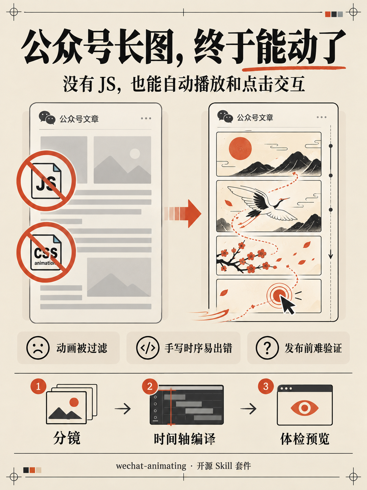
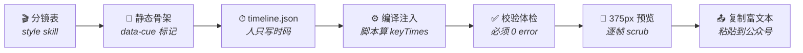

<div align="center">

# wechat-animating

**让公众号文章动起来，也让读者点一下。**

一套给 AI agent 用的 Skill 套件：从分镜到发布，产出能在微信公众号正文里
**自动播放、响应点击**的纯矢量 SVG 长卷

`零 JS` · `零外链` · `纯白名单兼容` · `纯矢量`

<br>

[](https://JamieJustTang.github.io/wechat-animating/)
[](LICENSE)
[](wechat-animating-authoring/references/smil-cookbook.md)

<br>

<a href="https://JamieJustTang.github.io/wechat-animating/">
  
</a>

*10 屏长卷会自动播放。滚到交互幕，点一下，看看连线如何生长。*

</div>

---

## ✨ 它能做出什么

<table>
  <tr>
    <td align="center" width="33%"><b>01 · 为什么要它</b><br>公众号只能发图文？</td>
    <td align="center" width="33%"><b>02 · 点一下会怎样</b><br>交互的玩法</td>
    <td align="center" width="33%"><b>03 · 不点也会动</b><br>自动播放的玩法</td>
  </tr>
  <tr>
    <td><a href="social/xiaohongshu/01-pain-points.png"></a></td>
    <td><a href="social/xiaohongshu/02-practice-example.png"></a></td>
    <td><a href="social/xiaohongshu/03-auto-play-practices.png"></a></td>
  </tr>
  <tr>
    <td>动效受限 · 时序易错 · 发布前难验证<br><b>用 SVG 动画 + 脚本编译 + 本地体检</b></td>
    <td>点击长出连线 · 揭晓答案 · 逐字打字<br><b>光标跟着字走，故事跟着点走</b></td>
    <td>路径自己画出来 · 图形呼吸摇摆 · 内容滑入定格<br><b>分镜设定时码，编译生成 SVG 动画</b></td>
  </tr>
</table>

> 想亲手试试？**[打开在线演示](https://JamieJustTang.github.io/wechat-animating/)**，这些都是同一套流水线做出来的。

## 🧩 为什么是 SMIL

微信公众号正文是**标签白名单制富文本**，不是网页：

| 微信 sanitiser 的行为 | 对你的意味着 |
|---|---|
| 剥掉 `<script>` / `on*` 事件 / 外链资源 | ❌ 不能用 JS |
| 剥掉或改造 `<style>` 块 | ❌ 不能用 CSS `@keyframes` |
| **保留** `<svg>` 及属性级 `animate` / `animateTransform` | ✅ **只能靠 SMIL + `begin="click"`** |

这就是"SVG 交互排版"成为公众号黑科技的根本原因——也是这套套件存在的理由：把这条窄路走成一条可复现的流水线。

## ⚙️ 制作流水线



核心原则只有一条：**人不手写 `keyTimes`**。手写 101 个 `keyTimes="0;0.0888;0.0987;1"` 是错一次死一次的活，而且错了不报错、只是不动——所以时码表归人写，换算归脚本。

## 📦 套件结构

```
wechat-animating/
├── wechat-animating/               Hub：流程总控 · 失败模式表 · 截图自检
├── wechat-animating-style/         视觉风格母题库 · 分镜构思 best practice
├── wechat-animating-authoring/     骨架规范 · 时间轴 DSL · 编译/校验脚本
│   ├── references/timeline-dsl.md      DSL 规范（cues / typewriter / loops / interactive）
│   ├── references/smil-cookbook.md     手写 SMIL 配方
│   ├── references/wechat-whitelist.md  微信白名单清单
│   ├── scripts/timeline_compile.py     时码 → keyTimes 编译并注入
│   └── scripts/validate_svg.py         白名单 + SMIL 合法性体检
├── wechat-animating-editor/        单文件离线编辑器：预览 · 逐帧 scrub · 甘特图 · 复制富文本
└── examples/how-it-moves/          完整示例：10 屏 zine《它是怎么动起来的》
```

## 🚀 快速开始

```bash
# 1. 装进你的 agent skills 目录（WorkBuddy / Claude Code 通用结构）
git clone https://github.com/JamieJustTang/wechat-animating.git
cp -R wechat-animating/wechat-animating* ~/.workbuddy/skills/

# 2. 跑通示例：生成骨架 → 编译注入 → 体检
cd wechat-animating/examples/how-it-moves
python3 build.py                                                # 静态骨架
python3 ../../wechat-animating-authoring/scripts/timeline_compile.py \
        inject timeline.json skeleton.svg -o zine.svg --force    # 编译注入
python3 ../../wechat-animating-authoring/scripts/validate_svg.py zine.svg  # 必须 0 error

# 3. 预览（或直接双击 preview.html）
python3 ../wechat-animating-editor/scripts/serve.py
```

然后对 agent 说一句："帮我做一卷讲 XX 的公众号 zine"——分镜、骨架、时码、校验，它按 Hub 里的 SOP 走完全程。

## 🔬 逆向出来的关键技术

从 [AGI Hunt《Claude by Claude》](https://mp.weixin.qq.com/s/0MZAVGggQZ0LJdx5IlM41Q)（2026-09，主体 `750×11980` 纯矢量、287KB、532 个 `<text>`、187 个动画标签）逐条逆向而来，详见各 reference 文档：

| 技术 | 一句话 |
|---|---|
| **伪造全局时间轴** | SMIL 没有全局时间轴；让所有 `animate` 共用一个 `dur`（如 22.3s）+ `begin="0s"`，用归一化 `keyTimes` 0~1 定位各自的出现时刻 |
| **四段式** | `0→a` 隐藏 · `a→b` 过渡 · `b→1` 保持——长卷自动播放的基本单元 |
| **透明热区 + 嵌套层** | `visibility="hidden"` 的元素收不到点击。把 N 个元素嵌成 N 层 `<g>`，最内层放 `pointer-events="all"` 的透明热区；点击沿冒泡同时触发各层——**stagger 是结构造出来的，不是动画属性** |
| **pathLength 归一化** | `stroke-dasharray="100 100"` 必须配 `pathLength="100"`，否则长路径只画 100px 就断 |
| **打字机** | 逐字拆 `<tspan>` 挂 discrete visibility；光标每字平移一个 font-size。**别给 tspan 手写 `dx`**——CJK 自然步进已有一个字宽，再加就双倍字距、光标永远落后一拍 |
| **叙事性 vs 演示性动画** | 挂主时间轴的元素越靠后可见率越低（(T−t)/T）——讲原理的过程演示要用独立短循环（4~7s）反复重播 |

打字机逐帧验证（`你` → `你好` → `你好。` + 光标跟随）：

<p align="center">
  
</p>

## 📰 示例：《它是怎么动起来的》

**[在线版直接看 →](https://JamieJustTang.github.io/wechat-animating/)**

`examples/how-it-moves/` 是一个用本套件从头做出来的 10 屏 zine，内容本身就在讲这套套件的原理——吃自己的狗粮：

- 750×7000 纯矢量 · 115KB · 67 条 animate · 校验 0 error
- P1–P6 / P10 走 `timeline.json` 编译；P7–P9 手写独立短循环，演示编译、注入、冒泡三个原理
- 附 `分镜表.md`（分镜构思模板）和 `shot.py`（Chrome headless 冻结 SMIL 逐帧自检）

```bash
python3 shot.py 8.95 9.2 11.0   # 冻结到指定时刻逐帧截图
```

## ⚠️ 已知限制

- 微信偶尔二次清洗内联 `style` → 备用路径：第三方编辑器（秀米 / 135 / 壹伴）的 HTML 源码入口粘贴
- SVG 内文字不可选中、不可被微信搜索 → 正文需另留真实文字
- 单卷建议 viewBox 高度 <20000、源码 <500KB，超出拆段
- 真机与桌面字体回退有差异，**群发前必须手机预览**

## 📚 参考

- 样本：AGI Hunt《Claude by Claude》（参考 Ethan Mollick 的 zine《STATELESS #1》）
- [`doocs/md`](https://github.com/doocs/md)（13.3k★）：Markdown → 微信富文本，与本套件互补
- [`cailven/opensvg`](https://github.com/cailven/opensvg)：组件式 SVG 交互编辑思路

---

<div align="center">

**[▶ 看在线演示](https://JamieJustTang.github.io/wechat-animating/)** · **[跑通示例](#-快速开始)** · MIT License

*如果这套 Skill 帮你做出了会动的公众号文章，欢迎 star ⭐*

</div>
