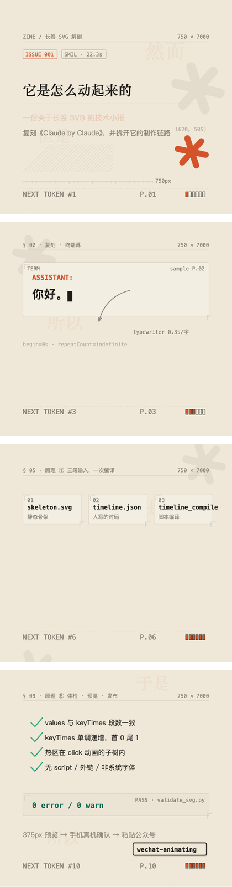
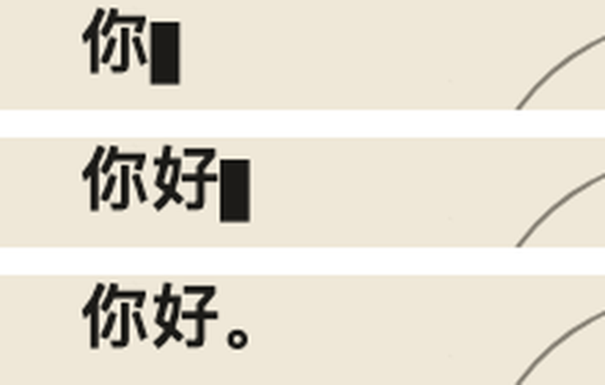

# wechat-animating

**微信公众号「长卷 SVG zine」制作套件** —— 让 AI agent 产出能在公众号正文里自动播放、可点击的**纯矢量动画长图**。

参考样本：AGI Hunt《Claude by Claude》（2026-09）——`viewBox="0 0 750 11980"`、287KB 源码、532 个 `<text>`、**0 张位图**、187 个动画标签。本套件是对它的完整逆向 + 可复现的工程化封装。

**[▶ 在线演示](https://JamieJustTang.github.io/wechat-animating/)** —— 用本套件做的 10 屏示例《它是怎么动起来的》，动画会自动播放，滚到交互幕**点一下画面**。

<p align="center">
  <a href="https://JamieJustTang.github.io/wechat-animating/"></a>
</p>

## 为什么只能用 SMIL

微信公众号正文是**标签白名单制富文本**，不是网页：

- 剥掉 `<script>` / `<iframe>` / 外链资源 / `on*` 事件 → **不能用 JS**
- 剥掉或改造 `<style>` 块 → **不能靠 CSS `@keyframes`**
- 但保留 `<svg>` 及其属性级的 `animate` / `animateTransform` 声明

所以动效只能靠 **SMIL**，交互只能靠 **`begin="click"`**。这是"SVG 交互排版"成为公众号黑科技的根本原因。

## 套件结构

```
wechat-animating/            ← Hub：流程总控 + 失败模式表 + 截图自检
├── wechat-animating-style/      视觉风格母题库 + 分镜构思 best practice
├── wechat-animating-authoring/  SVG 骨架规范 + 时间轴 DSL + 编译/校验脚本
│   ├── references/timeline-dsl.md      时间轴 DSL 规范（cues/typewriter/loops/interactive）
│   ├── references/smil-cookbook.md     手写 SMIL 配方
│   ├── references/wechat-whitelist.md  微信白名单清单
│   └── scripts/timeline_compile.py     时码 → keyTimes 编译并注入
│   └── scripts/validate_svg.py         白名单 + SMIL 合法性体检
├── wechat-animating-editor/     单文件离线编辑器（预览/逐帧 scrub/体检/甘特图/复制富文本）
└── examples/how-it-moves/       完整示例：10 屏 zine《它是怎么动起来的》
```

## 快速开始

```bash
# 1. 装进你的 agent skills 目录（WorkBuddy / Claude Code 通用结构）
git clone https://github.com/JamieJustTang/wechat-animating.git
cp -R wechat-animating/wechat-animating* ~/.workbuddy/skills/

# 2. 跑通示例：重新生成 + 编译 + 体检
cd wechat-animating/examples/how-it-moves
python3 build.py                                                # 静态骨架
python3 ../../wechat-animating-authoring/scripts/timeline_compile.py \
        inject timeline.json skeleton.svg -o zine.svg --force    # 编译注入
python3 ../../wechat-animating-authoring/scripts/validate_svg.py zine.svg  # 必须 0 error

# 3. 预览（或直接双击 preview.html）
python3 ../wechat-animating-editor/scripts/serve.py
```

工作流：**分镜表 → 静态骨架（打 `data-cue` 标记）→ timeline.json 时码表 → 编译注入 → 体检 → 375px 预览 → 复制富文本粘进公众号后台**。

人不手写 `keyTimes`——手写 101 个 `keyTimes="0;0.0888;0.0987;1"` 是错一次死一次的活，而且错了不报错、只是不动。

## 逆向出来的关键技术

| 技术 | 一句话 |
|---|---|
| **伪造全局时间轴** | SMIL 没有全局时间轴；让所有 `animate` 共用一个 `dur`（如 22.3s）+ `begin="0s"`，用归一化 `keyTimes` 0~1 定位各自的出现时刻 |
| **四段式** | `0→a` 隐藏 · `a→b` 过渡 · `b→1` 保持——长卷自动播放的基本单元 |
| **透明热区 + 嵌套层** | `visibility="hidden"` 的元素收不到点击。把 N 个元素嵌成 N 层 `<g>`，最内层放 `fill-opacity="0" visibility="visible" pointer-events="all"` 的热区；点击沿冒泡同时触发各层，**stagger 是结构造出来的，不是动画属性** |
| **pathLength 归一化** | `stroke-dasharray="100 100"` 必须配 `pathLength="100"`，否则长路径只画 100px 就断 |
| **打字机** | 逐字拆 `<tspan>` 挂 discrete visibility；光标每字平移一个 font-size。**别给 tspan 手写 `dx`**——CJK 自然步进已有一个字宽，再加就双倍字距、光标永远落后一拍 |
| **叙事性 vs 演示性动画** | 挂 22.3s 主时间轴的元素，越靠后可见率越低（(T−t)/T）——讲原理的过程演示要用独立短循环（4~7s）反复重播 |

打字机逐帧验证（`你` → `你好` → `你好。` + 光标跟随）：

<p align="center">
  
</p>

## 示例：《它是怎么动起来的》

**[在线版直接看 →](https://JamieJustTang.github.io/wechat-animating/)**（源文件 `docs/demo.html`，即 `zine.svg` 套一层 375px 微信视口外壳）

`examples/how-it-moves/` 是一个用本套件做的 10 屏 zine，本身就在讲这套套件的原理：

- 750×7000 纯矢量、115KB、67 条 animate、0 error
- P1–P6 / P10 走 `timeline.json` 编译；P7–P9 手写独立短循环演示编译/注入/冒泡原理
- 含 `分镜表.md`（分镜构思模板）、`shot.py`（Chrome headless 冻结 SMIL 逐帧自检）

```bash
python3 shot.py 8.95 9.2 11.0   # 冻结到指定时刻逐帧截图
```

## 小红书配图

- [图 1：公众号只能发图文？现在，交互动画玩起来！](social/xiaohongshu/01-pain-points.png)
- [图 2：六种动画与交互 Practice](social/xiaohongshu/02-practice-example.png)

两张竖版 PNG 可直接用于图文发布。第二张为玩法示意图；可操作的动画请打开上方在线演示。

## 已知限制

- 微信偶尔二次清洗内联 `style` → 备用路径：第三方编辑器（秀米/135/壹伴）的 HTML 源码入口粘贴
- SVG 内文字不可选中、不可被微信搜索 → 正文需另留真实文字
- 单卷建议 viewBox 高度 <20000、源码 <500KB，超出拆段
- 真机与桌面字体回退有差异，群发前必须手机预览

## 参考

- 样本：AGI Hunt《Claude by Claude》（参考 Ethan Mollick 的 zine《STATELESS #1》）
- `doocs/md`（13.3k★）：Markdown→微信富文本，与本套件互补
- `cailven/opensvg`：组件式 SVG 交互编辑思路

## License

MIT
